# Equity Research Pro

[](https://huggingface.co/spaces/LumoraX/equity-research-pro)
[](https://ai.google.dev/)
[](https://react.dev/)
[](https://nodejs.org/)
[](https://huggingface.co/spaces/LumoraX/equity-research-pro)

> **Institutional-grade AI equity research for Indian listed companies.**  
> Upload annual report PDFs → Get sector-specific ratios, MD&A intelligence, forensic analysis, and AI chat in under 60 seconds.

**Built during Edunet Foundation × IBM SkillsBuild × AICTE AI Internship — May–Jun 2026**

---

## 🔗 Live Demo

**Try it now:** [huggingface.co/spaces/LumoraX/equity-research-pro](https://huggingface.co/spaces/LumoraX/equity-research-pro)

> Requires a free [Gemini API key](https://aistudio.google.com/app/apikey) — takes 30 seconds to get one.

---

## The Problem This Solves

Equity research for Indian listed companies is:
- **Manual** — analysts spend 10–15 hours extracting data from 400-page PDF annual reports
- **Generic** — existing tools apply EBITDA logic to banks (EBITDA does not exist for banks)
- **Incomplete** — forensic red flags (promoter pledging, RPT anomalies, auditor changes) are routinely missed
- **Fragmented** — no single free tool combines PDF extraction + ratios + MD&A analysis + AI chat

This tool fixes all four problems in one platform.

---

## Screenshots

### Setup — API Key Entry Screen
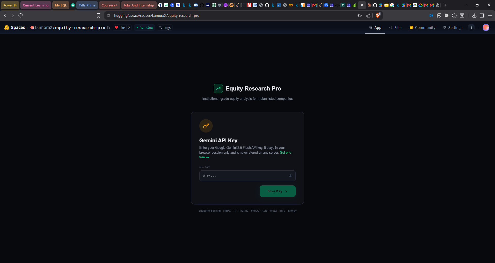

### Upload Panel — Sector Selection + 3-Year PDF Upload
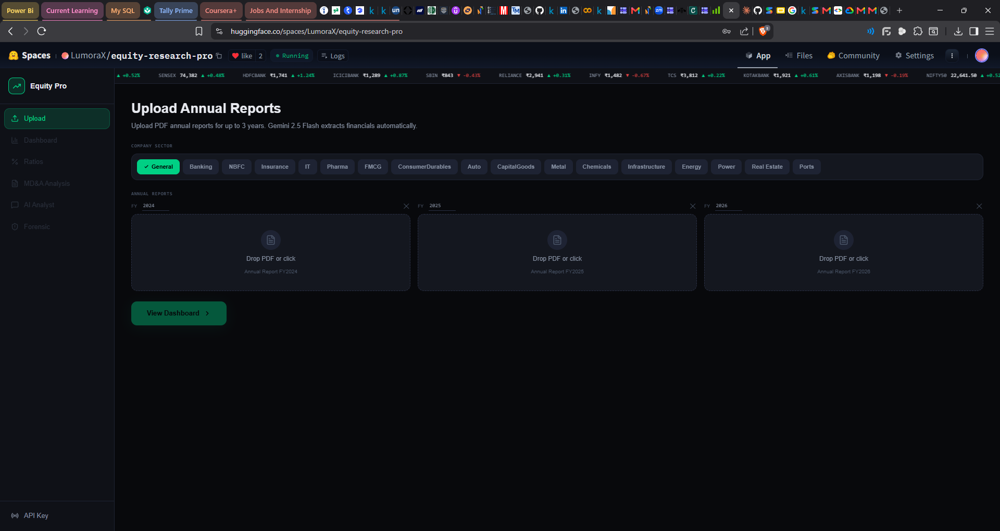

### Dashboard Overview — Revenue, Profitability & Cash Flow Charts
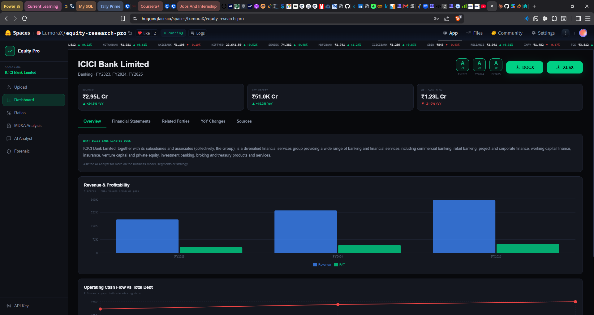

### Financial Statements Tab — P&L, Cash Flow, Balance Sheet
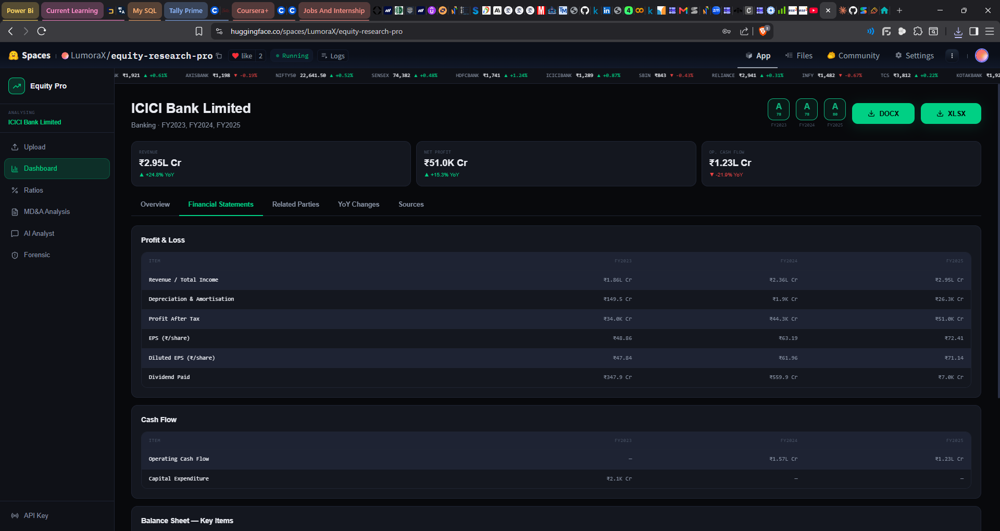

### Related Parties + Contingent Liabilities
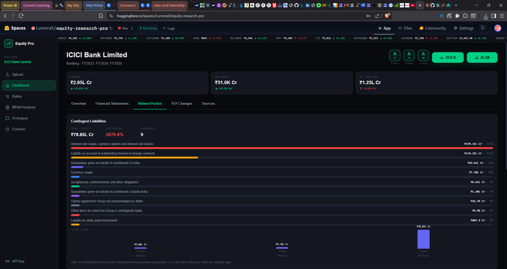

### YoY Changes — Governance & Key Risks Comparison
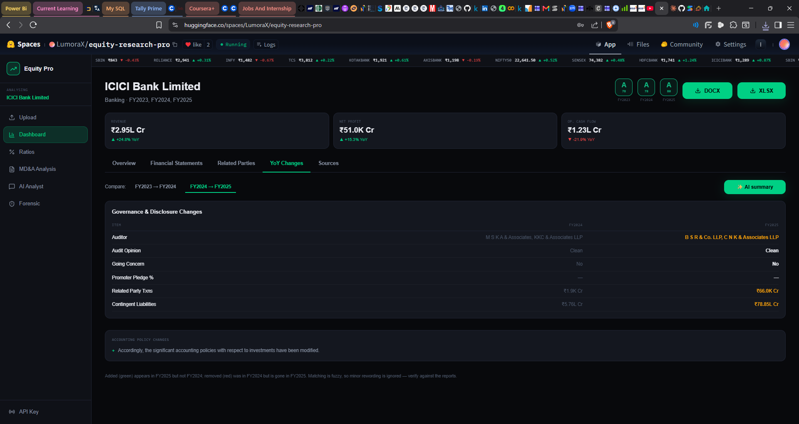

### Sources Tab — Page-Level Citations
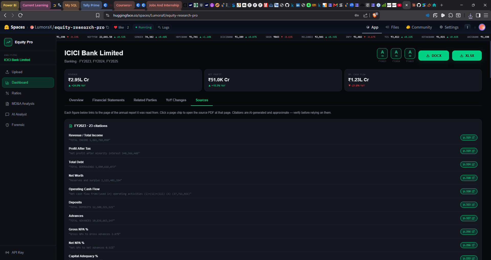

### Ratio Analysis — Sector-Specific Metrics
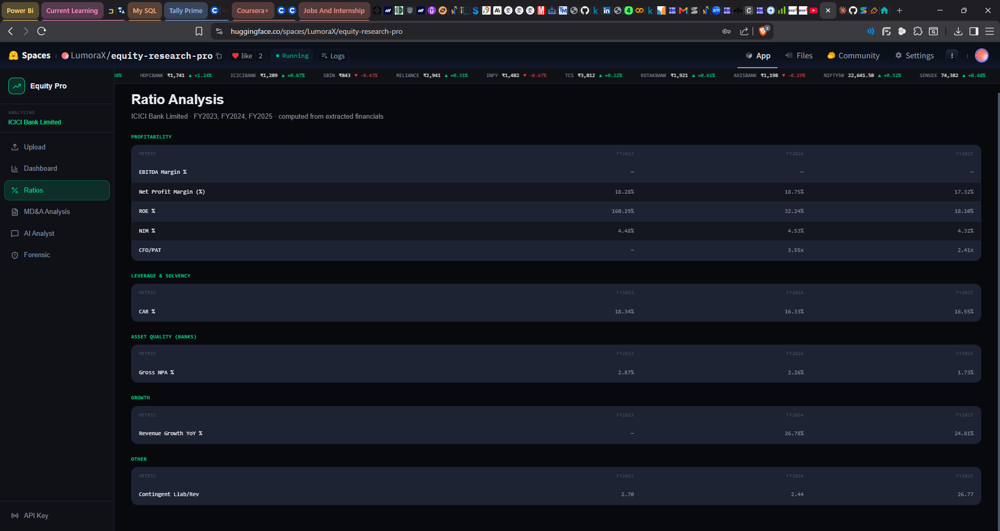

### MD&A Analysis — Raw Extraction View
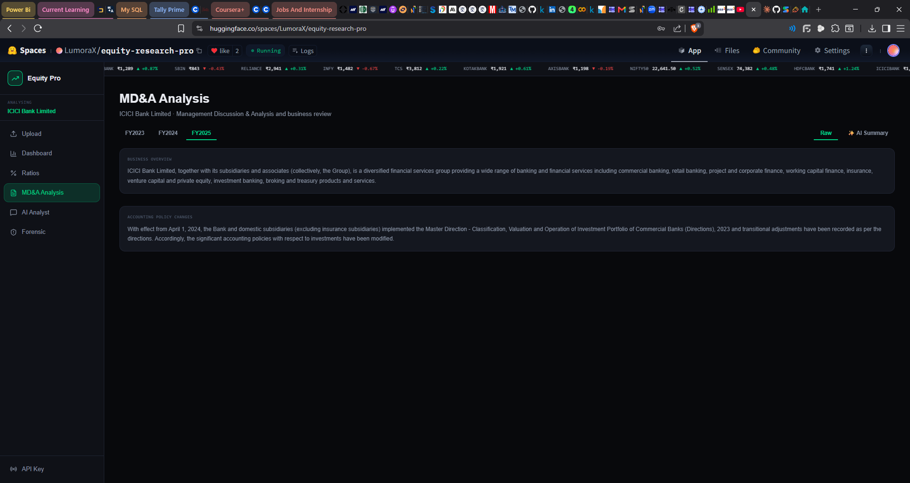

### MD&A Analysis — AI Summary View
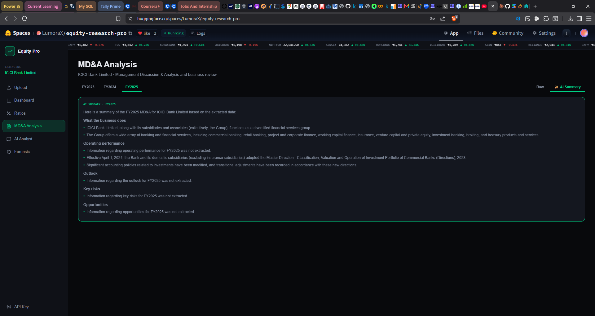

### AI Analyst Chat
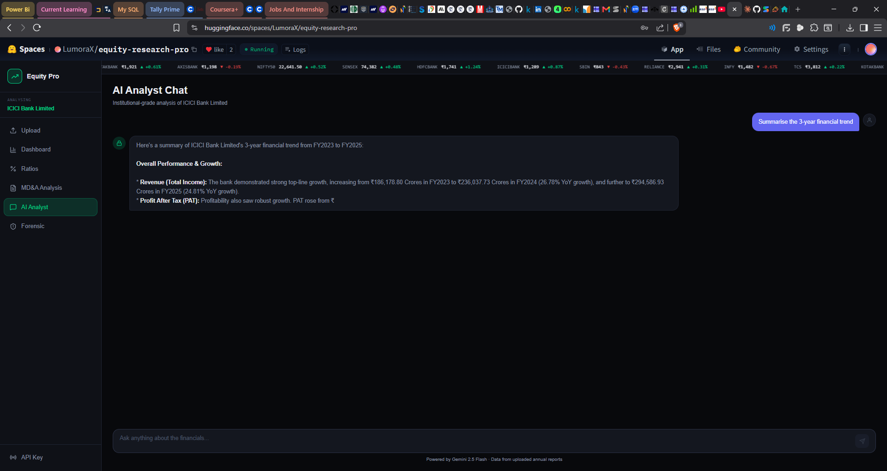

### Forensic Analysis — Flags, Trends, Governance
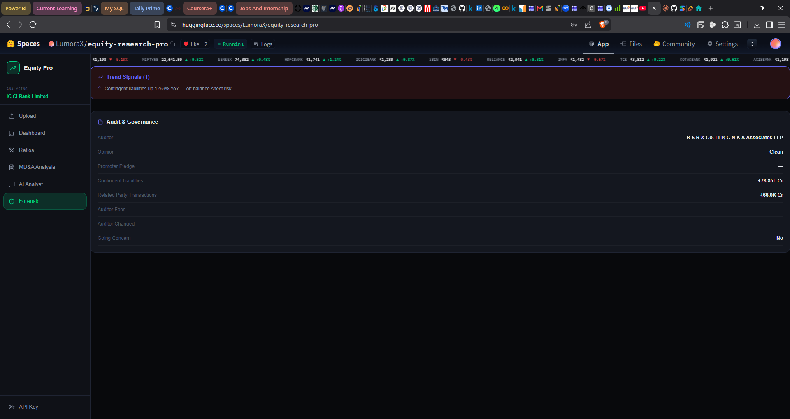

---

## Features

### 1. Three-Year PDF Annual Report Extraction
Upload annual reports for FY2023, FY2024, and FY2025 simultaneously with a Consolidated/Standalone toggle. Gemini 2.5 Flash extracts 20–25 financial data points per year — every number is linked to its exact page in the source PDF.

### 2. Seventeen Sector-Specific Ratio Engines

| Sector | Key Metrics |
|--------|------------|
| Banking | NIM, Gross NPA %, Net NPA %, CAR %, ROE, CFO/PAT |
| NBFC | NIM, Gross NPA %, Net NPA %, CAR %, Cost of Funds %, ROAA %, AUM |
| Insurance | Solvency Ratio, Combined Ratio % (General), Claims Ratio % (General), VNB Margin % (Life), 13M Persistency % (Life) |
| IT | EBITDA Margin, Attrition Rate %, Revenue/Employee, ROE |
| Pharma | EBITDA Margin, R&D/Revenue %, FDA Warning Letters, Specialty/Revenue % |
| FMCG | EBITDA Margin, Inventory Days, DSO (Days), ROE, ROCE |
| ConsumerDurables | EBITDA Margin, Inventory Days, DSO (Days), ROE |
| Auto | EBITDA Margin, Operating Margin %, EBITDA per unit, Inventory Days, DSO (Days) |
| CapitalGoods | EBITDA Margin, Inventory Days, DSO (Days), Order Book |
| Metal | EBITDA Margin, Capacity Utilization %, Inventory Days, DSO (Days) |
| Chemicals | EBITDA Margin, Capacity Utilization %, R&D/Revenue % |
| Infrastructure | EBITDA Margin, Order Book/Revenue, Interest Coverage, CWIP/Total Assets % |
| Energy | EBITDA Margin, Capex, D/E Ratio |
| Power | Plant Load Factor % (PLF), Plant Availability %, Regulated RoE %, Receivable Days |
| Real Estate | Pre-sales, Collections/Pre-sales %, Net Debt/Equity, Embedded EBITDA Margin % |
| Ports | Capacity Utilisation %, port EBITDA margin %, Net Debt/EBITDA, Realisation/Tonne |
| General | EBITDA Margin, Net Profit Margin, Debt/Equity, ROE, ROCE |

### 3. MD&A Intelligence + NarrativeDiff Engine
Extracts Management Discussion & Analysis sections across 3 years — Business Overview, Highlights, Risks, Opportunities, Key Audit Matters, Accounting Policy Changes. The **NarrativeDiff engine** compares text year-over-year at the sentence level:
- 🟢 **Green (+)** = statement added in the newer year
- 🔴 **Red (−)** = statement dropped from the previous year

### 4. Forensic Accounting Engine
Scores 8 risk dimensions automatically:
- Promoter pledging percentage and trends
- Related-party transaction amounts and as % of revenue
- Contingent liabilities as % of revenue (with category breakdown)
- Auditor name, opinion (clean/qualified/adverse), and changes
- Going concern flags
- Key audit matters extraction

### 5. AI Analyst Chat
Institutional-grade Q&A powered by Gemini, grounded in the uploaded annual reports. Built-in quick prompts:
- Summarise the 3-year financial trend
- Identify key forensic risks
- What is the DuPont decomposition of ROE?
- Evaluate debt sustainability
- Compare operating leverage across years

### 6. Sources Tab with Page Citations
Every extracted data point shows the exact page number it came from in the original PDF. Analysts can verify any figure in seconds.

### 7. YoY Changes Dashboard
Side-by-side governance comparison between years: auditor changes, audit opinion changes, going concern status, promoter pledge changes, contingent liability and RPT shifts. Highlighted in orange when a meaningful change occurred.

### 8. DOCX + XLSX Report Export
One-click download of a complete equity research report as a Word document or Excel workbook.

### 9. Annual Score Badges
Each year gets a letter grade (D / C / B / B+ / A) based on a weighted composite of sector-specific ratio performance.

---

## Project Structure

```
equity-research-pro/
│
├── src/
│   ├── components/                    # React UI components (11 panels)
│   │   ├── Dashboard.tsx              # Main hub — Overview, Financials, Related Parties, YoY, Sources
│   │   ├── RatiosPanel.tsx            # Sector-specific ratio tables (6 categories)
│   │   ├── ForensicPanel.tsx          # Forensic flags, trend signals, audit & governance
│   │   ├── MDAPanel.tsx               # MD&A extraction viewer (Raw + AI Summary)
│   │   ├── NarrativeDiffPanel.tsx     # Sentence-level year-over-year MD&A comparison
│   │   ├── ChatPanel.tsx              # AI Analyst chat with quick prompts
│   │   ├── UploadPanel.tsx            # PDF upload, sector selection, FY year configuration
│   │   ├── RelatedPartyPanel.tsx      # Contingent liabilities + RPT breakdown
│   │   ├── SourcesTab.tsx             # Page citation viewer for all extracted fields
│   │   ├── Sidebar.tsx                # Navigation panel with company context
│   │   └── SetupPanel.tsx             # API key entry screen
│   │
│   ├── lib/                           # Business logic and utilities
│   │   ├── scoring.ts                 # ⭐ 17 sector-specific scoring engines + ratio calculators
│   │   ├── types.ts                   # TypeScript interfaces for all data structures
│   │   ├── reportDocx.ts              # Word document generator
│   │   ├── reportXlsx.ts              # Excel workbook generator
│   │   └── format.ts                  # Number formatting (₹ Crores, %, ratios)
│   │
│   ├── App.tsx                        # Root component, global state, routing
│   ├── index.css                      # Global styles + dark theme
│   └── main.tsx                       # Vite entry point
│
├── server.ts                          # ⭐ Express backend — Gemini extraction prompts + API routes
├── Dockerfile                         # Container config for Hugging Face Spaces deployment
├── package.json                       # Dependencies and scripts
├── tsconfig.json                      # TypeScript configuration
├── vite.config.ts                     # Vite build configuration
├── index.html                         # HTML entry point
├── .env.example                       # Environment variable template
│
├── docs/                              # Project documentation
│   ├── ARCHITECTURE.md                # System design and data flow
│   ├── SECTOR_LOGIC.md                # Financial rationale for sector scoring
│   └── INTERNSHIP_CONTEXT.md          # Internship background and learnings
│
└── screenshots/                       # App screenshots for README
    ├── 01_upload.png
    ├── 02_dashboard_overview.png
    ├── 03_financial_statements.png
    ├── 04_ratios_banking.png
    ├── 05_mda_narrativediff.png
    ├── 06_forensic.png
    ├── 07_related_parties.png
    ├── 08_yoy_changes.png
    ├── 09_sources.png
    └── 10_ai_analyst.png
```

> **⭐ Most important files for review:**
> - `server.ts` — all Gemini extraction prompts live here
> - `src/lib/scoring.ts` — all 12 sector scoring engines
> - `src/lib/types.ts` — data architecture
> - `src/components/ForensicPanel.tsx` — forensic logic

---

## Tech Stack

| Component | Technology | Purpose |
|-----------|-----------|---------|
| AI Model | Gemini 2.5 Flash | PDF extraction, MD&A parsing, AI chat |
| Frontend | React 18 + TypeScript + Vite | UI, state management, routing |
| Backend | Node.js + Express | API server, ratio calculation, report generation |
| Charts | Recharts | Revenue, Cash Flow, ratio trend visualization |
| Reports | docx + xlsx libraries | Word and Excel export |
| Container | Docker | Consistent runtime environment |
| Hosting | Hugging Face Spaces | Free cloud deployment with CI/CD |

---

## How to Run Locally

### Prerequisites
- Node.js v18 or higher
- A free [Gemini API key](https://aistudio.google.dev/)

### Setup

```bash
# 1. Clone the repository
git clone https://github.com/Simaran-Shaikh-04/AICTE-BATCH-1-Equity-Research-Pro.git
cd AICTE-BATCH-1-Equity-Research-Pro

# 2. Install dependencies
npm install

# 3. Configure environment
cp .env.example .env
# Open .env and add your Gemini API key

# 4. Start development server
npm run dev
```

Visit `http://localhost:3000` — enter your Gemini API key in the app setup wizard to begin.

### Run with Docker

```bash
docker build -t equity-research-pro .
docker run -p 7860:7860 -e GEMINI_API_KEY=your_key equity-research-pro
```

---

## Key Design Decisions

**Why sector-specific scoring?**
EBITDA margin means nothing for a bank. A bank's operational quality is captured by Net Interest Margin (how efficiently it lends), GNPA % (quality of its loan book), and Capital Adequacy Ratio (regulatory buffer). Applying manufacturing-sector ratios to banks produces scores that are technically wrong. Each of the 12 sector engines uses only the metrics relevant to that industry.

**Why page citations for every number?**
AI extraction errors are real. A 400-page annual report contains thousands of numbers, and Gemini can sometimes pick the wrong table or fiscal year. Every extracted value is linked to its source page so analysts can verify any figure in 10 seconds before using it.

**Why NarrativeDiff?**
Year-over-year changes in management language are often more important than the numbers themselves. When a company quietly drops a risk disclosure or changes how it describes its debt position, that's a signal. No free Indian equity tool offered this — so it was built from scratch.

**Why the forensic engine?**
Indian retail investors routinely miss red flags that institutional analysts catch — promoter pledging trends, RPT escalation, auditor changes. Automating these checks at zero cost democratises what was previously a manual institutional process.

---

## Validation

Tested against real annual reports from NSE-listed companies:

| Company | Years Tested | Verified Against |
|---------|-------------|-----------------|
| HDFC Bank Limited | FY2023, FY2024, FY2025 | Screener.in |
| ICICI Bank Limited | FY2023, FY2024, FY2025 | Screener.in |

HDFC Bank FY2025 auditor change (M M Nissim & Co → Price Waterhouse LLP) was correctly detected and flagged by the forensic engine.

---

## Internship Context

| Field | Details |
|-------|---------|
| Program | Edunet Foundation × IBM SkillsBuild × AICTE — AI Internship |
| Duration | 6 weeks (May 11 – June 21, 2026) |
| Student | Simaran Shaikh |
| College | Don Bosco College, Panjim, Goa |
| Degree | BCom Financial Accounting (Year 3) |
| Internship ID | INTERNSHIP_177546286369d369cf3ffb2 |

**Role clarity:** I designed the financial logic — sector-specific scoring benchmarks, forensic accounting rules, ratio selection per sector, and validation methodology. Implementation code was generated with AI assistance. This distinction is reflected honestly in all documentation.

---

## Roadmap

- [ ] Standardize revenue extraction using RBI Schedule 14/15 labels for all Indian bank formats
- [ ] Real-time NSE/BSE market data integration (live P/E, P/B, dividend yield)
- [ ] Multi-company peer comparison on a single dashboard
- [ ] DCF intrinsic value model alongside ratio scoring
- [ ] Automated portfolio screening — rank sector companies by composite score
- [ ] International expansion: US SEC 10-K, UK Companies House filings

---

## License

MIT License — free to use, modify, and distribute with attribution.

---

*Built by [Simaran Shaikh](https://www.linkedin.com/in/simaran-shaikh) | [Portfolio](https://simaran-shaikh-04.github.io) | [Live App](https://huggingface.co/spaces/LumoraX/equity-research-pro)*